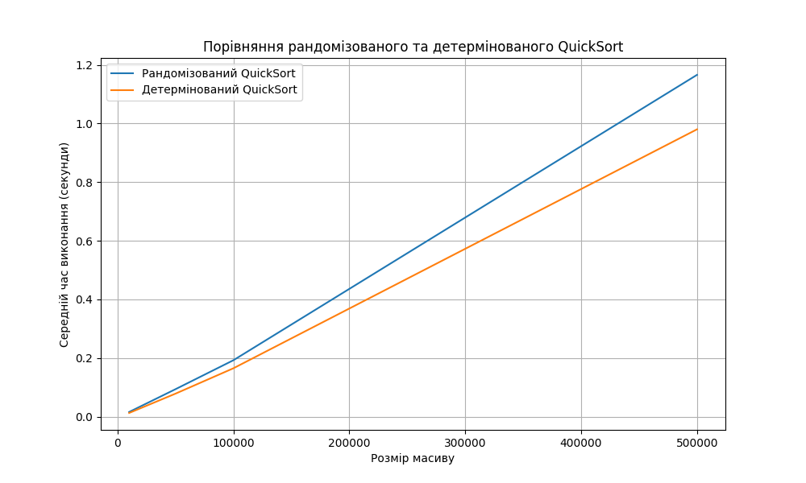

<a id="top"></a>

# goit-algo2-hw-10

**Зміст**

<a href="#1"></a> <a href="#2"></a>

---

<a id="1"></a>

## Порівняння рандомізованого та детермінованого QuickSort

Реалізовано рандомізований та детермінований алгоритми сортування QuickSort. Проведено порівняльний аналіз їхньої ефективності, вимірявши середній час виконання на масивах різного розміру.

💻 **Код реалізації**

- реалізує обидва алгоритми QuickSort
- генерує тестові масиви
- вимірює середній час виконання
- виводить результати в табличній формі
- будує графік для візуального порівняння

📊 **Аналіз та висновки**
📈 **Результати вимірювань**
Результати, отримані після виконання коду, демонструють, що на **випадково згенерованих даних** обидва алгоритми QuickSort показують дуже схожий час виконання. Це очікувано, оскільки на таких масивах вибір опорного елемента (будь то випадковий чи фіксований) з високою ймовірністю забезпечує ефективне розбиття масиву.

```Bash
Порівняльний аналіз QuickSort:

Розмір масиву: 10000
   Рандомізований QuickSort: 0.0159 секунд
   Детермінований QuickSort: 0.0130 секунд
Розмір масиву: 50000
   Рандомізований QuickSort: 0.0912 секунд
   Детермінований QuickSort: 0.0756 секунд
Розмір масиву: 100000
   Рандомізований QuickSort: 0.1932 секунд
   Детермінований QuickSort: 0.1605 секунд
Розмір масиву: 500000
   Рандомізований QuickSort: 1.1749 секунд
   Детермінований QuickSort: 0.9915 секунд


Зведена таблиця результатів:
--------------------------------------------------
Розмір масиву        | Рандомізований (сек) | Детермінований (сек)
--------------------------------------------------
10000                | 0.015939299999990907      | 0.012999959999979183     
50000                | 0.09123865999999907       | 0.0755909800000154       
100000               | 0.19324957999997422       | 0.16047513999992588      
500000               | 1.174946480000017         | 0.9914721000001009       
--------------------------------------------------
```



Ці дані підтверджують, що в **середньому випадку** QuickSort має складність $O(n log n)$, незалежно від способу вибору опорного елемента.

💡 **Висновки**
**Детермінований QuickSort** (з фіксованим опорним елементом) у найгіршому випадку має складність $O(n^2$). Це відбувається, коли масив вже відсортований або майже відсортований, і кожен вибір опорного елемента призводить до незбалансованого розбиття (наприклад, один підмасив порожній, а інший містить *n−1* елементів). Такий сценарій може бути використаний для атаки на алгоритм.

**Рандомізований QuickSort** є значно стійкішим до таких випадків. Випадковий вибір опорного елемента гарантує, що найгірший випадок $O(n^2$) є **надзвичайно малоймовірним**, оскільки для його реалізації потрібна специфічна послідовність випадкових чисел. Таким чином, навіть якщо вхідні дані є "поганими" для детермінованої версії, рандомізований варіант майже завжди працюватиме з очікуваною складністю $O(n log n)$.

Отже, хоча в середньому часі виконання обидва алгоритми показують схожі результати, **рандомізований QuickSort є набагато надійнішим** і використовується на практиці частіше, оскільки його продуктивність менш залежить від структури вхідних даних.

[Top :arrow_double_up:](#top)

---

<a id="2"></a>

## Складання розкладу занять за допомогою жадібного алгоритму

Реалізовано програму для складання розкладу занять в університеті, використовуючи жадібний алгоритм для задачі покриття множини. Мета полягає в призначенні викладачів на предмети таким чином, щоб мінімізувати кількість викладачів та покрити всі предмети.

**Опис рішення**

Жадібний алгоритм (Greedy Algorithm) — це евристичний підхід, який на кожному етапі приймає локально оптимальне рішення з надією, що воно приведе до глобально оптимального результату. У нашому випадку, на кожному кроці ми вибираємо викладача, який може закрити найбільшу кількість ще не покритих предметів. Якщо є декілька таких кандидатів, ми обираємо наймолодшого, щоб додати додатковий критерій вибору. Цей метод відомий **як задача про покриття множини** (Set Cover Problem), яка є NP-повною. Жадібний алгоритм — це один зі способів знайти наближене рішення.

1. **Клас** ```Teacher```: Цей клас зберігає інформацію про викладача: ім'я, вік, електронну пошта та множину предметів, які він може викладати. Ми також додамо атрибут ```assigned_subjects``` для зберігання призначених предметів.

2. **Функція** ```create_schedule```:

- Створюємо копію множини предметів, які потрібно покрити, ```uncovered_subjects```, та порожній список для майбутнього розкладу ```schedule```.
- Доти, доки ```uncovered_subjects``` не порожня:

    - Знаходимо "найкращого" викладача, який закриває найбільшу кількість ще не покритих предметів. Для цього ми перебираємо всіх доступних викладачів.
    - Кількість нових предметів, які викладач може покрити, обчислюється як розмір перетину множини ```can_teach_subjects``` викладача і множини ```uncovered_subjects```.
    - Якщо декілька викладачів можуть покрити однакову максимальну кількість предметів, обираємо того, хто молодший.
    - Якщо ```best_teacher``` не знайдено, тобто жоден з викладачів не може покрити жоден з предметів, ми виходимо з циклу і повертаємо None. Це відповідає критерію 2.
    - Інакше, ми додаємо ```best_teacher``` до нашого ```schedule```. Ми також визначаємо, які саме предмети він буде викладати, і видаляємо ці предмети з ```uncovered_subjects```.

3. Головний блок ```if __name__ == '__main__':```:

- В цьому блоці ініціалізуємо множину ```subjects``` та список ```teachers``` згідно з умовами завдання.
- Викликаємо функцію ```create_schedule``` і виводимо результат. Якщо розклад створено, програма друкує інформацію про викладачів та їхні предмети. Якщо ні, виводиться відповідне повідомлення.

**Як це працює?**

Програма починає з множини всіх предметів, які потрібно покрити. На кожному кроці вона виконує наступні дії:

1. **Ітерація 1**:

- Перевіряються всі викладачі.
- **Олександр Іваненко** може покрити 2 предмети: ```{'Математика', 'Фізика'}```.
- **Марія Петренко** — 1 предмет: ```{'Хімія'}```.
- **Сергій Коваленко** — 2 предмети: ```{'Інформатика', 'Математика'}```.
- **Наталія Шевченко** — 2 предмети: ```{'Біологія', 'Хімія'}```.
- **Дмитро Бондаренко** — 2 предмети: ```{'Фізика', 'Інформатика'}```.
- **Олена Гриценко** — 1 предмет: ```{'Біологія'}```.
- Кілька викладачів (Олександр, Сергій, Наталія, Дмитро) можуть покрити по 2 предмети. Згідно з правилом, обираємо **наймолодшого** з них.
- Вік: Наталія (29) < Дмитро (35) < Олександр (45) < Сергій (50).
- Вибирається **Наталія Шевченко**. Їй призначаються предмети ```{'Біологія', 'Хімія'}```.
- Множина непокритих предметів тепер: ```{'Математика', 'Фізика', 'Інформатика'}```.

2. **Ітерація 2**:

- Непокриті предмети: ```{'Математика', 'Фізика', 'Інформатика'}```.
- Перевіряємо викладачів, які ще не призначені.
- **Олександр Іваненко** може покрити 2 предмети: ```{'Математика', 'Фізика'}```.
- **Сергій Коваленко** — 2 предмети: ```{'Інформатика', 'Математика'}```.
- **Дмитро Бондаренко** — 2 предмети: {'Фізика', 'Інформатика'}.
- Знову маємо трьох викладачів з однаковою кількістю нових предметів. Згідно з правилом, обираємо **наймолодшого**: Дмитро (35) < Олександр (45) < Сергій (50).
- Вибирається **Дмитро Бондаренко**. Йому призначаються предмети ```{'Фізика', 'Інформатика'}```.
- Множина непокритих предметів тепер: ```{'Математика'}```.

3. **Ітерація 3**:

- Непокритий предмет: ```{'Математика'}```.
- Перевіряємо викладачів.
- **Олександр Іваненко** може покрити 1 предмет: ```{'Математика'}```.
- **Сергій Коваленко** — 1 предмет: ```{'Математика'}```.
- Обидва можуть покрити потрібний предмет. Обираємо наймолодшого: Олександр (45) < Сергій (50).
- Вибирається **Олександр Іваненко**. Йому призначається предмет ```{'Математика'}```.
- Множина непокритих предметів стає порожньою.

Цикл завершується, і ми отримуємо фінальний розклад, який покриває всі предмети.

```Bash
Розклад занять:
✔️ Наталія Шевченко, 29 років, email: n.shevchenko@example.com
   Викладає предмети: Біологія, Хімія

✔️ Дмитро Бондаренко, 35 років, email: d.bondarenko@example.com
   Викладає предмети: Фізика, Інформатика

✔️ Олександр Іваненко, 45 років, email: o.ivanenko@example.com
   Викладає предмети: Математика
```

[Top :arrow_double_up:](#top)

---

>[!tip]
>Створення віртуального оточення:
>```python -m venv venv```
>```venv\Scripts\activate```
>```pip install -r requirements.txt```
>Деактивація віртуального оточення:
>```deactivate```

```Bash
python quicksort_comparison.py
```

```Bash
python schedule_maker.py
```

[Top :arrow_double_up:](#top)